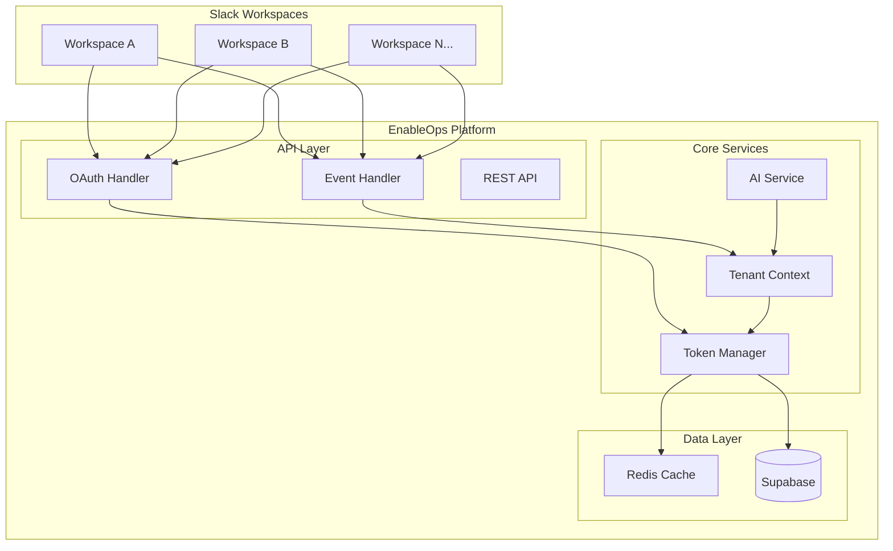
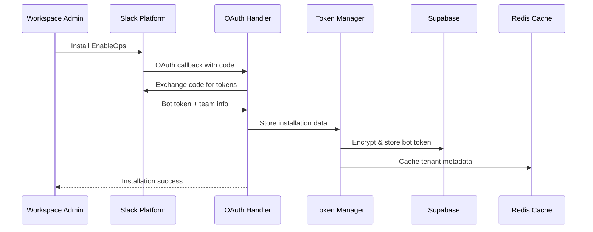
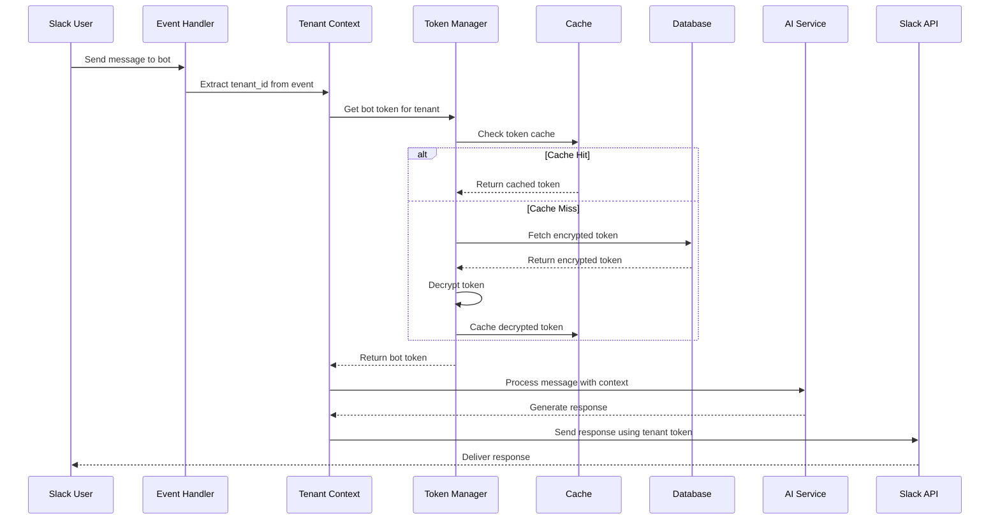

# Design Document

## Overview

The Dynamic Slack Bot Token Management system transforms EnableOps from a single-tenant application to a true multi-tenant SaaS platform. This design implements secure, scalable token management that allows each Slack workspace to have its own isolated bot instance while maintaining enterprise-grade security and performance.

The system replaces the current global `SLACK_BOT_TOKEN` approach with a dynamic token retrieval system that fetches workspace-specific tokens from Supabase, enabling EnableOps to serve 100+ concurrent tenants as outlined in the PRD success metrics.

## Architecture

### High-Level Architecture



### Token Management Flow



### Request Processing Flow



## Components and Interfaces

### 1. Token Manager Service

**Purpose**: Central service for managing workspace-specific bot tokens with encryption, caching, and lifecycle management.

**Key Methods**:
```python
class TokenManager:
    async def store_installation(self, installation_data: SlackInstallation) -> bool
    async def get_bot_token(self, tenant_id: str) -> Optional[str]
    async def refresh_token(self, tenant_id: str) -> bool
    async def revoke_token(self, tenant_id: str) -> bool
    async def cleanup_expired_tokens(self) -> int
```

**Security Features**:
- AES-256 encryption for token storage
- Tenant-specific encryption keys
- Automatic key rotation
- Token expiration handling
- Audit logging for all token operations

### 2. Tenant Context Manager

**Purpose**: Provides tenant-aware context for all operations, ensuring proper isolation and data scoping.

**Key Methods**:
```python
class TenantContextManager:
    async def get_tenant_context(self, team_id: str) -> TenantContext
    async def create_tenant_client(self, tenant_id: str) -> SlackClient
    async def validate_tenant_access(self, tenant_id: str, user_id: str) -> bool
    async def get_tenant_settings(self, tenant_id: str) -> TenantSettings
```

**Context Data**:
- Tenant metadata (company name, plan, features)
- Bot token and API client
- User profiles and permissions
- Feature flags and limits
- Usage metrics and quotas

### 3. Multi-Tenant Slack Client Factory

**Purpose**: Creates isolated Slack API clients for each tenant with proper token management and rate limiting.

**Key Methods**:
```python
class SlackClientFactory:
    async def get_client(self, tenant_id: str) -> TenantSlackClient
    async def create_client(self, tenant_id: str, bot_token: str) -> TenantSlackClient
    def cleanup_idle_clients(self) -> int
```

**Client Features**:
- Per-tenant rate limiting
- Connection pooling
- Automatic retry logic
- Error handling and fallback
- Metrics collection

### 4. OAuth Installation Handler

**Purpose**: Manages the complete OAuth flow from installation initiation to tenant provisioning.

**Key Methods**:
```python
class OAuthHandler:
    async def initiate_installation(self) -> str  # Returns OAuth URL
    async def handle_callback(self, code: str, state: str) -> InstallationResult
    async def provision_tenant(self, installation: SlackInstallation) -> bool
    async def handle_uninstall(self, team_id: str) -> bool
```

**Installation Steps**:
1. Generate secure state parameter
2. Redirect to Slack OAuth
3. Handle callback and exchange code
4. Validate and store installation data
5. Create tenant and admin user
6. Provision sample documents
7. Send welcome message

### 5. Event Router and Processor

**Purpose**: Routes incoming Slack events to appropriate tenant-specific handlers with proper isolation.

**Key Methods**:
```python
class EventRouter:
    async def route_event(self, event: SlackEvent) -> bool
    async def process_message(self, tenant_id: str, event: MessageEvent) -> bool
    async def handle_app_mention(self, tenant_id: str, event: AppMentionEvent) -> bool
    async def process_interactive_event(self, tenant_id: str, payload: dict) -> bool
```

**Routing Logic**:
- Extract tenant_id from event
- Validate tenant status
- Load tenant context
- Route to appropriate handler
- Handle errors gracefully

## Data Models

### Enhanced Database Schema

```sql
-- Tenants table (enhanced)
CREATE TABLE tenants (
    id UUID PRIMARY KEY DEFAULT gen_random_uuid(),
    team_id VARCHAR(20) UNIQUE NOT NULL,
    team_name VARCHAR(255) NOT NULL,
    encrypted_bot_token TEXT NOT NULL,
    encryption_key_id VARCHAR(50) NOT NULL,
    bot_user_id VARCHAR(20) NOT NULL,
    installed_by VARCHAR(20) NOT NULL,
    installer_name VARCHAR(255) NOT NULL,
    plan VARCHAR(20) DEFAULT 'free',
    status VARCHAR(20) DEFAULT 'active',
    settings JSONB DEFAULT '{}',
    created_at TIMESTAMP DEFAULT NOW(),
    updated_at TIMESTAMP DEFAULT NOW(),
    last_active TIMESTAMP DEFAULT NOW(),
    token_expires_at TIMESTAMP,
    INDEX idx_team_id (team_id),
    INDEX idx_status (status),
    INDEX idx_last_active (last_active)
);

-- Installation events table
CREATE TABLE installation_events (
    id UUID PRIMARY KEY DEFAULT gen_random_uuid(),
    team_id VARCHAR(20) NOT NULL,
    event_type VARCHAR(50) NOT NULL,
    event_data JSONB NOT NULL,
    created_at TIMESTAMP DEFAULT NOW(),
    INDEX idx_team_id (team_id),
    INDEX idx_event_type (event_type),
    INDEX idx_created_at (created_at)
);

-- Token audit log
CREATE TABLE token_audit_log (
    id UUID PRIMARY KEY DEFAULT gen_random_uuid(),
    tenant_id VARCHAR(20) NOT NULL,
    operation VARCHAR(50) NOT NULL,
    success BOOLEAN NOT NULL,
    error_message TEXT,
    ip_address INET,
    user_agent TEXT,
    created_at TIMESTAMP DEFAULT NOW(),
    INDEX idx_tenant_id (tenant_id),
    INDEX idx_operation (operation),
    INDEX idx_created_at (created_at)
);

-- Encryption keys table
CREATE TABLE encryption_keys (
    id VARCHAR(50) PRIMARY KEY,
    key_data TEXT NOT NULL,
    created_at TIMESTAMP DEFAULT NOW(),
    expires_at TIMESTAMP NOT NULL,
    status VARCHAR(20) DEFAULT 'active'
);
```

### Pydantic Models

```python
class SlackInstallation(BaseModel):
    team_id: str
    team_name: str
    bot_token: str
    bot_user_id: str
    installer_id: str
    installer_name: str
    scopes: List[str]
    enterprise_id: Optional[str] = None
    is_enterprise_install: bool = False

class TenantContext(BaseModel):
    tenant_id: str
    team_name: str
    bot_user_id: str
    plan: str
    status: str
    settings: Dict[str, Any]
    features: List[str]
    limits: Dict[str, int]
    last_active: datetime

class TokenMetadata(BaseModel):
    tenant_id: str
    encrypted_token: str
    encryption_key_id: str
    expires_at: Optional[datetime]
    created_at: datetime
    last_used: datetime

class InstallationEvent(BaseModel):
    team_id: str
    event_type: str
    installer_id: str
    installer_name: str
    scopes: List[str]
    metadata: Dict[str, Any]
    timestamp: datetime
```

## Error Handling

### Error Categories and Responses

1. **Token Not Found**
   - Log: Tenant token missing for team_id
   - Response: Prompt admin to reinstall app
   - Action: Mark tenant as inactive

2. **Token Invalid/Expired**
   - Log: Token validation failed
   - Response: Attempt token refresh if possible
   - Fallback: Request reinstallation

3. **Rate Limiting**
   - Log: Rate limit exceeded for tenant
   - Response: Queue request for retry
   - Action: Implement exponential backoff

4. **Database Errors**
   - Log: Database operation failed
   - Response: Use cached data if available
   - Fallback: Graceful degradation

5. **Encryption Errors**
   - Log: Token decryption failed
   - Response: Request token refresh
   - Action: Rotate encryption keys

### Error Recovery Strategies

```python
class ErrorRecoveryManager:
    async def handle_token_error(self, tenant_id: str, error: TokenError) -> RecoveryAction
    async def handle_rate_limit(self, tenant_id: str) -> RetryStrategy
    async def handle_database_error(self, operation: str) -> FallbackStrategy
    async def notify_tenant_admin(self, tenant_id: str, issue: str) -> bool
```

## Testing Strategy

### Unit Tests
- Token encryption/decryption
- Tenant context isolation
- OAuth flow validation
- Error handling scenarios
- Database operations

### Integration Tests
- End-to-end installation flow
- Multi-tenant message processing
- Token refresh workflows
- Database schema migrations
- Cache invalidation

### Load Tests
- Concurrent tenant operations
- Token retrieval performance
- Database connection pooling
- Memory usage under load
- Rate limiting effectiveness

### Security Tests
- Token encryption strength
- OAuth flow security
- SQL injection prevention
- Cross-tenant data isolation
- Audit log integrity

### Test Data Management
```python
class TestTenantFactory:
    @staticmethod
    def create_test_tenant(team_id: str = None) -> TenantContext
    
    @staticmethod
    def create_test_installation() -> SlackInstallation
    
    @staticmethod
    def cleanup_test_data(tenant_ids: List[str]) -> bool
```

## Performance Considerations

### Caching Strategy
- **Token Cache**: Redis with 1-hour TTL
- **Tenant Metadata**: Redis with 30-minute TTL
- **User Profiles**: Redis with 15-minute TTL
- **Feature Flags**: Redis with 5-minute TTL

### Database Optimization
- Connection pooling (10-50 connections per instance)
- Read replicas for tenant metadata
- Partitioning for audit logs
- Indexing on tenant_id and timestamps

### Scaling Considerations
- Horizontal scaling of API instances
- Database sharding by tenant_id
- CDN for static assets
- Load balancing with session affinity

### Monitoring and Metrics
```python
class MetricsCollector:
    def record_token_retrieval_time(self, tenant_id: str, duration: float)
    def record_installation_event(self, team_id: str, success: bool)
    def record_api_call_latency(self, tenant_id: str, endpoint: str, duration: float)
    def record_error_rate(self, tenant_id: str, error_type: str)
```

## Security Implementation

### Token Encryption
- AES-256-GCM encryption
- Tenant-specific encryption keys
- Key rotation every 90 days
- Hardware Security Module (HSM) for key storage

### Access Control
- Row-level security in Supabase
- API rate limiting per tenant
- IP allowlisting for admin operations
- OAuth scope validation

### Audit and Compliance
- Immutable audit logs
- GDPR compliance for data deletion
- SOC 2 Type II controls
- Regular security assessments

### Secrets Management
```python
class SecretsManager:
    async def get_encryption_key(self, key_id: str) -> bytes
    async def rotate_encryption_keys(self) -> bool
    async def encrypt_token(self, token: str, tenant_id: str) -> str
    async def decrypt_token(self, encrypted_token: str, tenant_id: str) -> str
```

This design provides a robust, scalable foundation for multi-tenant Slack bot token management while maintaining the security and performance standards required for enterprise SaaS applications.